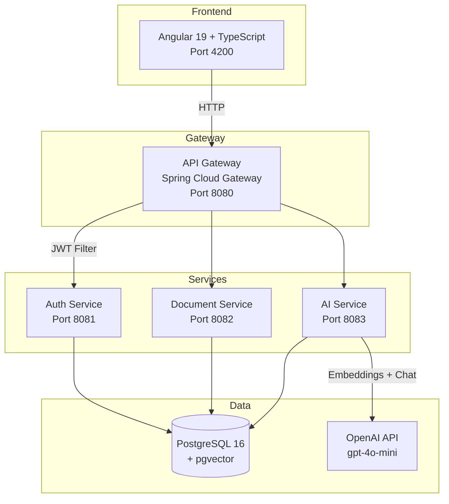
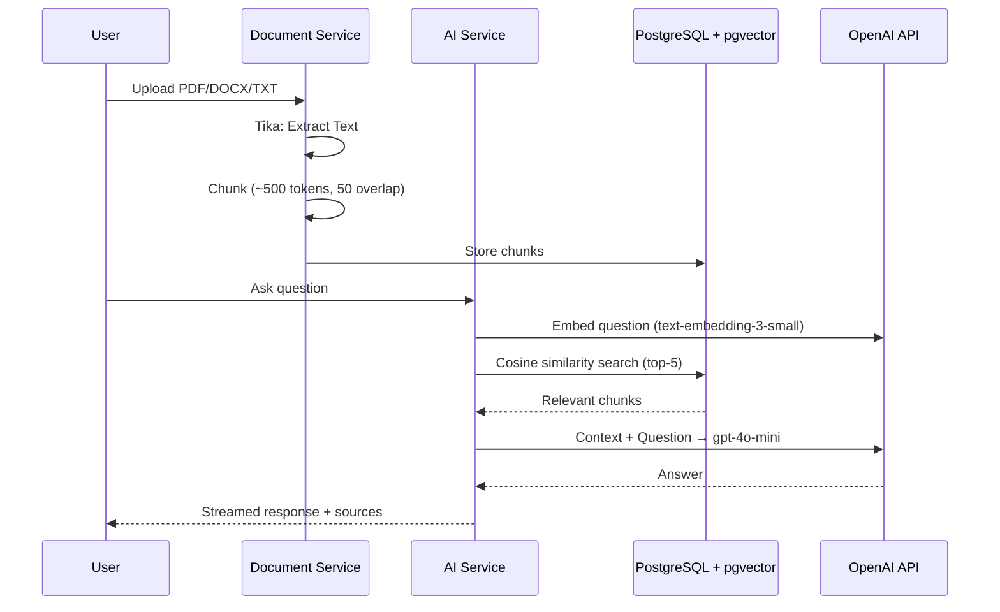

# DocAssist - AI-Powered Document Q&A Platform

A microservices-based document intelligence platform where users upload documents (PDF, DOCX, TXT) and ask natural language questions answered via **RAG (Retrieval-Augmented Generation)**.

## Architecture



## Tech Stack

| Layer | Technology |
|-------|-----------|
| **Frontend** | Angular 19 + TypeScript + Tailwind CSS + Angular Material |
| **Backend** | Java 21 + Spring Boot 3.4 + Spring Cloud 2024.0 |
| **AI/ML** | Spring AI 1.0 + OpenAI (gpt-4o-mini + text-embedding-3-small) |
| **Database** | PostgreSQL 16 + pgvector |
| **Doc Parsing** | Apache Tika |
| **Auth** | Spring Security + JWT (jjwt) |
| **Containers** | Docker + Docker Compose |
| **CI/CD** | Jenkins + GitHub Actions |
| **API Docs** | SpringDoc OpenAPI (Swagger UI) |
| **Testing** | JUnit 5 + Mockito + Testcontainers + Karma/Jasmine |

## RAG Pipeline



## Microservices

| Service | Port | Responsibility |
|---------|------|----------------|
| **API Gateway** | 8080 | Routing, JWT validation, CORS, rate limiting |
| **Auth Service** | 8081 | Register, login, JWT issue/refresh |
| **Document Service** | 8082 | Upload, parse (Tika), chunk, list, delete |
| **AI Service** | 8083 | Embed chunks, vector search, RAG chat |

## Project Structure

```
docassist/
├── backend/
│   ├── api-gateway/          Spring Cloud Gateway
│   ├── auth-service/         JWT authentication
│   ├── document-service/     Upload + parsing + chunking
│   ├── ai-service/           RAG pipeline + chat
│   └── common/               Shared DTOs, exceptions
├── frontend/                 Angular 19 + TypeScript
├── docker/
│   ├── docker-compose.yml    Full stack
│   ├── docker-compose.dev.yml Postgres only
│   └── init-db/init.sql      Schema setup + pgvector
├── jenkins/Jenkinsfile       CI/CD pipeline
├── .github/workflows/        PR checks
└── docs/                     Architecture docs
```

## Getting Started

### Prerequisites

- Java 21
- Maven 3.9+
- Node.js 20+
- Docker + Docker Compose
- OpenAI API Key

### Quick Start

1. **Start PostgreSQL:**
   ```bash
   cd docker
   docker compose -f docker-compose.dev.yml up -d
   ```

2. **Set OpenAI API Key:**
   ```bash
   export OPENAI_API_KEY=sk-your-key-here
   ```

3. **Run Backend Services** (from `backend/` directory):
   ```bash
   # Terminal 1: Auth Service
   mvn spring-boot:run -pl auth-service

   # Terminal 2: Document Service
   mvn spring-boot:run -pl document-service

   # Terminal 3: AI Service
   mvn spring-boot:run -pl ai-service

   # Terminal 4: API Gateway
   mvn spring-boot:run -pl api-gateway
   ```

4. **Run Frontend:**
   ```bash
   cd frontend
   npm install
   npx ng serve --proxy-config proxy.conf.json
   ```

5. **Open:** http://localhost:4200

### Full Stack (Docker)

```bash
cd docker
OPENAI_API_KEY=sk-your-key docker compose up --build
```

## API Endpoints

| Method | Endpoint | Description |
|--------|----------|-------------|
| POST | `/api/auth/register` | Register new user |
| POST | `/api/auth/login` | Login |
| POST | `/api/auth/refresh` | Refresh token |
| GET | `/api/auth/me` | Current user info |
| POST | `/api/documents` | Upload document (multipart) |
| GET | `/api/documents` | List user documents |
| GET | `/api/documents/{id}` | Get document |
| DELETE | `/api/documents/{id}` | Delete document |
| GET | `/api/documents/{id}/status` | Processing status |
| POST | `/api/ai/chat` | Ask question (RAG) |
| GET | `/api/ai/sessions` | List chat sessions |
| GET | `/api/ai/sessions/{id}` | Get session messages |
| DELETE | `/api/ai/sessions/{id}` | Delete session |

## Testing

```bash
# Backend unit tests
cd backend && mvn test

# Frontend tests
cd frontend && npx ng test
```

## License

MIT
