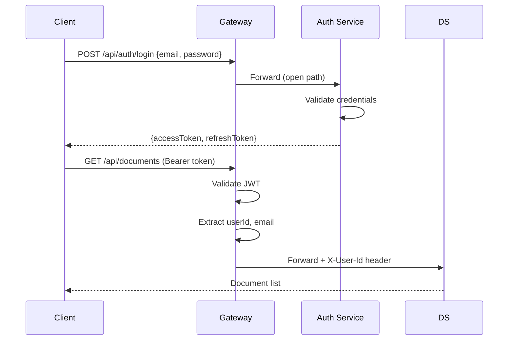

# DocAssist Architecture

## System Overview

DocAssist is a microservices-based document intelligence platform built with Java 21, Spring Boot 3.4, and Angular 19. It uses RAG (Retrieval-Augmented Generation) to answer natural language questions about uploaded documents.

## Architecture Diagram

```mermaid
graph TB
    subgraph "Client Layer"
        FE[Angular 19 SPA<br/>Tailwind CSS + Material]
    end

    subgraph "API Layer"
        GW[API Gateway :8080<br/>Spring Cloud Gateway<br/>JWT Filter + CORS + Rate Limit]
    end

    subgraph "Service Layer"
        AS[Auth Service :8081<br/>Spring Security + JWT]
        DS[Document Service :8082<br/>Apache Tika + Chunking]
        AIS[AI Service :8083<br/>Spring AI + OpenAI]
    end

    subgraph "Data Layer"
        PG[(PostgreSQL 16<br/>auth_db | document_db | ai_db)]
        PGV[(pgvector<br/>1536-dim embeddings)]
    end

    subgraph "External"
        OAI[OpenAI API<br/>gpt-4o-mini<br/>text-embedding-3-small]
    end

    FE --> GW
    GW --> AS
    GW --> DS
    GW --> AIS
    AS --> PG
    DS --> PG
    AIS --> PG
    AIS --> PGV
    AIS --> OAI
```

## Database Design

### Auth Schema (`auth_db`)

| Table | Columns |
|-------|---------|
| `users` | id (UUID PK), email (UNIQUE), password_hash, full_name, created_at, updated_at |

### Document Schema (`document_db`)

| Table | Columns |
|-------|---------|
| `documents` | id (UUID PK), user_id, filename, content_type, file_size, status (ENUM), page_count, created_at |
| `document_chunks` | id (UUID PK), document_id (FK), chunk_index, content (TEXT), token_count, created_at |

### AI Schema (`ai_db`)

| Table | Columns |
|-------|---------|
| `chunk_embeddings` | id (UUID PK), chunk_id, document_id, user_id, embedding (vector(1536)), content, created_at |
| `chat_sessions` | id (UUID PK), user_id, document_id, title, created_at |
| `chat_messages` | id (UUID PK), session_id (FK), role (ENUM), content (TEXT), source_chunks (JSONB), created_at |

## Authentication Flow



## Document Processing Pipeline

1. **Upload**: User sends multipart file via API Gateway
2. **Store**: File saved to local filesystem, metadata to PostgreSQL
3. **Extract**: Apache Tika extracts text from PDF/DOCX/TXT
4. **Chunk**: Text split into ~500 token chunks with 50 token overlap
5. **Status Update**: Document marked as READY (or FAILED on error)

## RAG Pipeline

1. **Query**: User asks a question
2. **Embed**: Question embedded via OpenAI text-embedding-3-small (1536 dimensions)
3. **Search**: pgvector cosine similarity search returns top-5 relevant chunks
4. **Augment**: Chunks assembled as context in a system prompt
5. **Generate**: gpt-4o-mini generates answer grounded in context
6. **Persist**: Question and answer saved to chat session

## Technology Decisions

| Decision | Choice | Rationale |
|----------|--------|-----------|
| API Gateway | Spring Cloud Gateway | Native Spring ecosystem, reactive, built-in rate limiting |
| Auth | JWT (stateless) | No session store needed, works with microservices |
| Vector DB | pgvector | Single database instance, no extra infrastructure |
| Embeddings | text-embedding-3-small | Cost-effective ($0.02/1M tokens), 1536 dimensions |
| Chat Model | gpt-4o-mini | Low cost ($0.15/1M input), good quality for RAG |
| Doc Parsing | Apache Tika | Multi-format support, battle-tested |
| Frontend State | Angular Signals | Modern Angular, fine-grained reactivity |

## Dev Workflow

- **Primary**: `docker-compose.dev.yml` (Postgres only) + run services via Maven
- **Full Stack**: `docker-compose up` for integration testing
- **Frontend**: `ng serve --proxy-config proxy.conf.json` proxies `/api` to gateway
